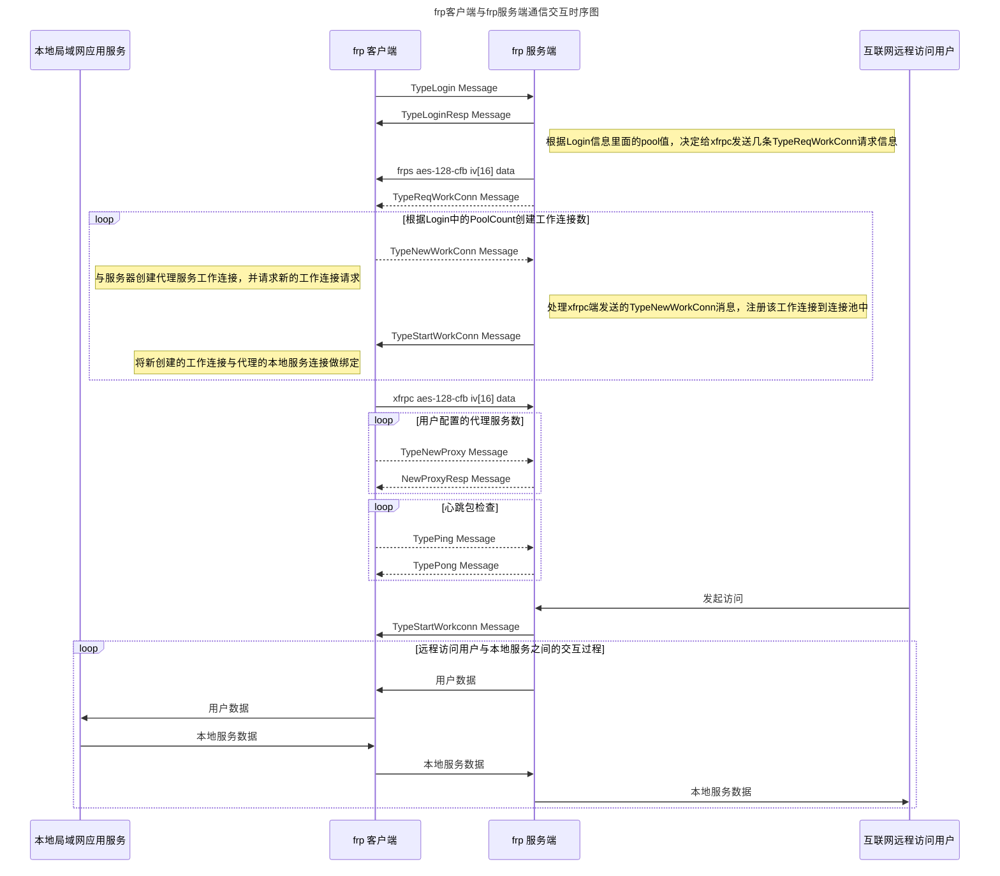

# rust-frp-client
frp client implemented with rust language

## frp protocol

## sequence diagram

```mermaid
sequenceDiagram
	title:	frp客户端与frp服务端通信交互时序图
	participant l_svc as 本地局域网应用服务
	participant frpc as frp 客户端
  participant frps as frp 服务端
  participant user as 互联网远程访问用户
  
  frpc ->> frps  : TypeLogin Message
  frps ->> frpc  : TypeLoginResp Message
  Note right of frps  : 根据Login信息里面的pool值，决定给xfrpc发送几条TypeReqWorkConn请求信息
  frps ->> frpc  : frps aes-128-cfb iv[16] data
  frps -->> frpc : TypeReqWorkConn Message
	loop 根据Login中的PoolCount创建工作连接数
  	frpc -->> frps  : TypeNewWorkConn Message
  	Note left of frpc  : 与服务器创建代理服务工作连接，并请求新的工作连接请求
  	Note right of frps  : 处理xfrpc端发送的TypeNewWorkConn消息，注册该工作连接到连接池中
  	frps ->> frpc  : TypeStartWorkConn Message
  	Note left of frpc  : 将新创建的工作连接与代理的本地服务连接做绑定
	end
  frpc ->> frps  : xfrpc aes-128-cfb iv[16] data
  loop 用户配置的代理服务数
  	frpc -->> frps : TypeNewProxy Message
  	frps -->> frpc : NewProxyResp Message
  end
	
  loop 心跳包检查
    frpc -->> frps : TypePing Message
    frps -->> frpc : TypePong Message
  end
  
  user ->> frps  : 发起访问
  frps ->> frpc	 : TypeStartWorkconn Message
  loop  远程访问用户与本地服务之间的交互过程
    frps ->> frpc   : 用户数据
    frpc ->> l_svc  : 用户数据
    l_svc ->> frpc  : 本地服务数据
    frpc ->> frps   : 本地服务数据
    frps  ->> user  : 本地服务数据
  end
  
```

