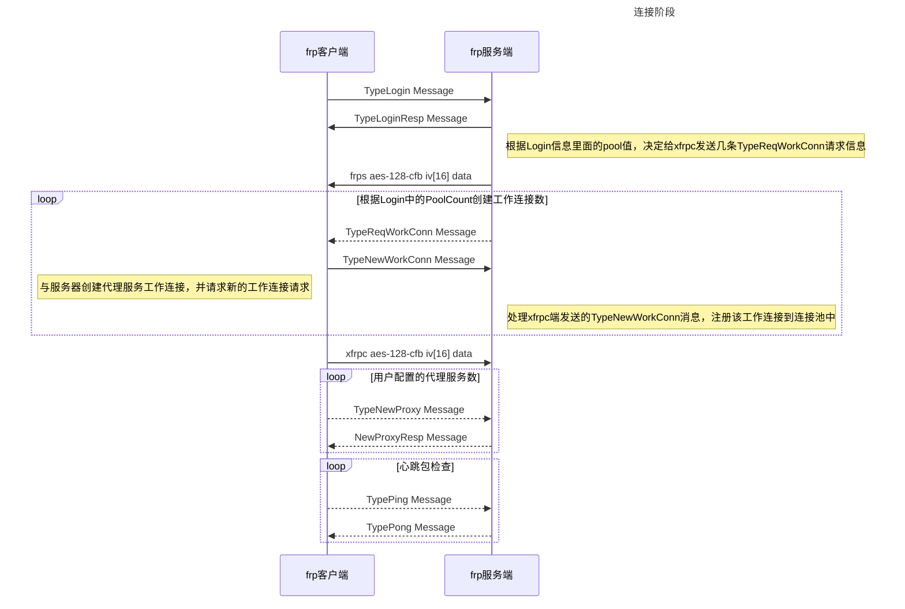
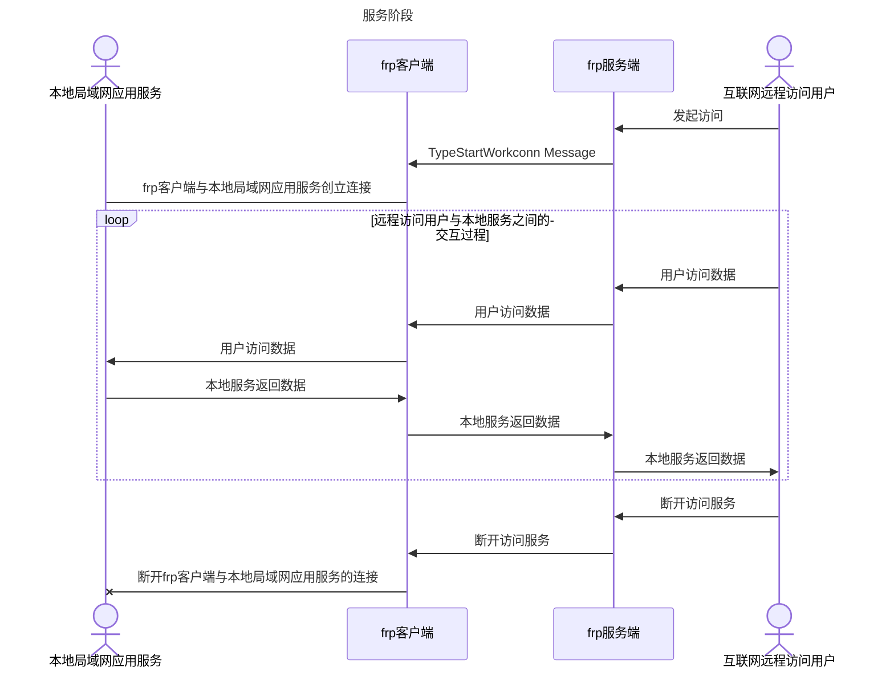

# rust-frp-client

用rust语言实现的frp客户端

## frp协议详解

将frp协议分为两个阶段： 连接阶段，服务阶段

## 连接阶段
 
 **实线代表明文，虚线代表密文，默认只有控制连接加密，工作连接不加密**
 

```mermaid
sequenceDiagram
	title:	连接阶段
	participant frpc as frp客户端
  participant frps as frp服务端
  
  frpc ->> frps  : TypeLogin Message
  frps ->> frpc  : TypeLoginResp Message
  Note right of frps  : 根据Login信息里面的pool值，决定给xfrpc发送几条TypeReqWorkConn请求信息
  frps ->> frpc  : frps aes-128-cfb iv[16] data
	loop 根据Login中的PoolCount创建工作连接数
		frps -->> frpc : TypeReqWorkConn Message
  	frpc ->> frps  : TypeNewWorkConn Message
  	Note left of frpc  : 与服务器创建代理服务工作连接，并请求新的工作连接请求
  	Note right of frps  : 处理xfrpc端发送的TypeNewWorkConn消息，注册该工作连接到连接池中
	end
  frpc ->> frps  : xfrpc aes-128-cfb iv[16] data
  loop 用户配置的代理服务数
  	frpc -->> frps : TypeNewProxy Message
  	frps -->> frpc : NewProxyResp Message
  end
	
  loop 心跳包检查
    frpc -->> frps : TypePing Message
    frps -->> frpc : TypePong Message
  end
```

## 服务阶段

```mermaid
sequenceDiagram
	title:	 服务阶段
	actor l_svc as 本地局域网应用服务
	participant frpc as frp客户端
  participant frps as frp服务端
  actor user as 互联网远程访问用户
  
  user ->> frps : 发起访问
  frps ->> frpc	: TypeStartWorkconn Message
	frpc -> l_svc	: frp客户端与本地局域网应用服务创立连接
  loop  远程访问用户与本地服务之间的交互过程
		user ->> frps 	: 用户访问数据
    frps ->> frpc   : 用户访问数据
    frpc ->> l_svc  : 用户访问数据
    l_svc ->> frpc  : 本地服务返回数据
    frpc ->> frps   : 本地服务返回数据
    frps  ->> user  : 本地服务返回数据
  end
  user ->> frps		: 断开访问服务
	frps ->> frpc 	: 断开访问服务
	frpc -x l_svc 	: 断开frp客户端与本地局域网应用服务的连接
```
